# Comparative Analysis: Schemathesis vs RESTler

## 1. Experiment Overview

This experiment compares two REST API fuzzing tools, Schemathesis and RESTler, using the OWASP crAPI application as the target API.

Both tools were executed against the same OpenAPI specification and the same local crAPI deployment. The goal was to compare their effectiveness in terms of API coverage, number of generated or sent requests, reproducible findings, and ability to explore stateful API behavior.

---

## 2. Schemathesis Execution

Schemathesis was executed using the OpenAPI specification and an authenticated bearer token.

The tool was able to process all 44 operations described in the specification. Across the three executions, Schemathesis generated thousands of test cases and reached full API coverage.

Schemathesis behaved as a more plug-and-play tool in this setup. After providing the schema, base URL, and authentication header, it was able to execute the experiment without requiring manual changes to the generated test logic.

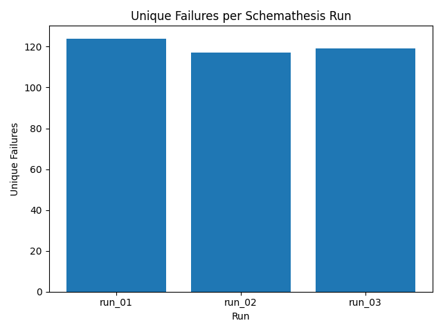

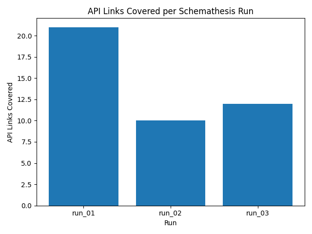

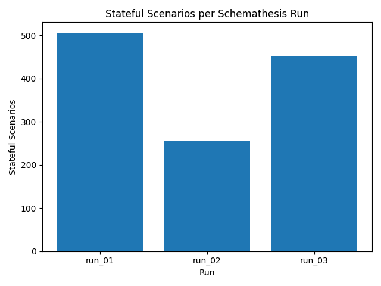

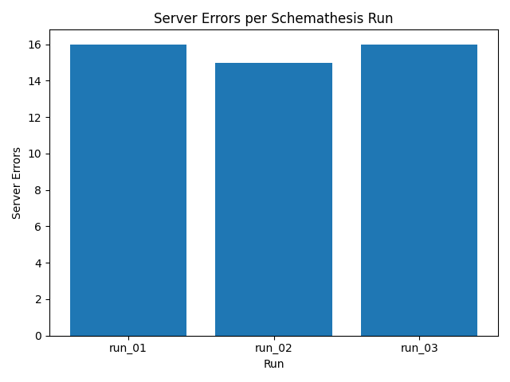

---

## 3. RESTler Execution

RESTler required more manual setup before producing comparable results.

Initially, RESTler achieved very low coverage because the authentication token was not being correctly inserted into the generated requests. The grammar contained an `authentication_token_tag` placeholder, but the configured token refresh command was not properly reflected in the requests.

To make the experiment fair, the generated RESTler grammar was manually adjusted to include a valid `Authorization: Bearer` header. After this correction, RESTler's coverage increased significantly.

A second issue was caused by the `/workshop/api/shop/return_qr_code` endpoint, which returns `image/png`. During fuzzing, RESTler attempted to process this binary response as UTF-8 text and failed with a `UnicodeDecodeError`. To prevent this tool-level crash, this endpoint was removed from the RESTler grammar for the final experimental runs.

After these adjustments, RESTler was executed three times using the same grammar, custom dictionary, and random seed.

Final RESTler results:

- Average coverage: 21.33 / 43 operations
- Average coverage percentage: 49.6%
- Average rendered requests: 36.67 / 43
- Average valid requests: 21.33
- Average total requests sent: 273.67
- Average dynamic objects created: 172.67
- Average reproducible bug buckets: 22.33

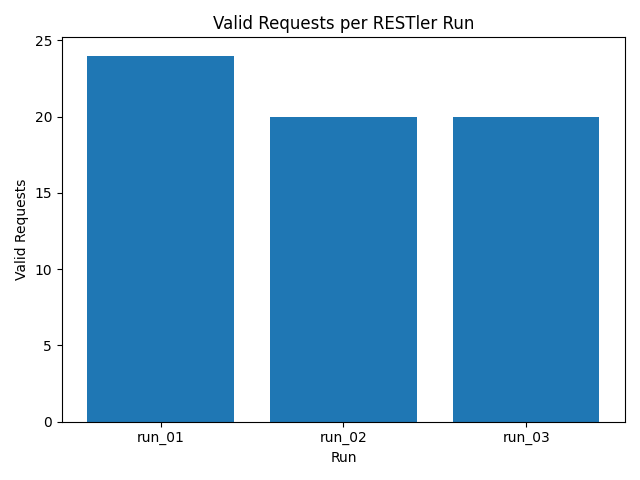

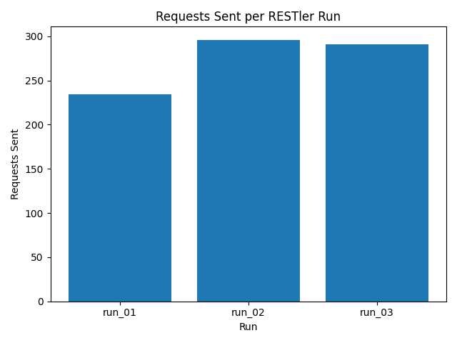

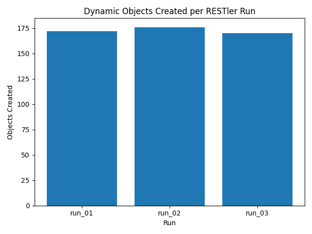

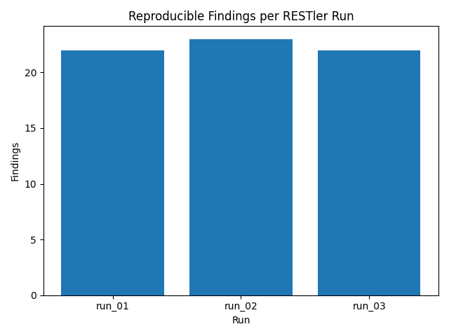

---

## 4. Comparative Results

The comparison shows that Schemathesis achieved higher API coverage and generated a much larger number of test cases. RESTler, on the other hand, showed stronger stateful behavior by creating many dynamic objects and using specialized checkers such as `InvalidDynamicObjectChecker`.

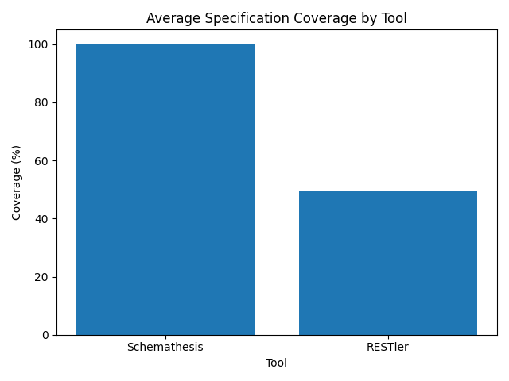

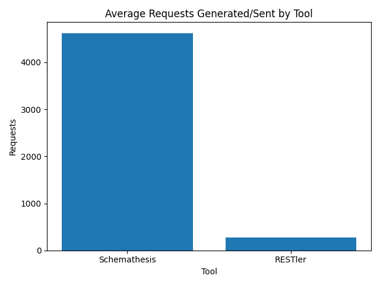

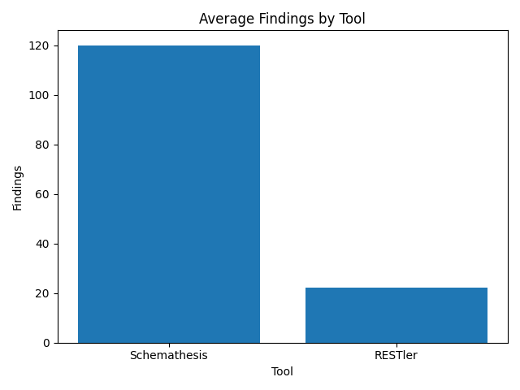

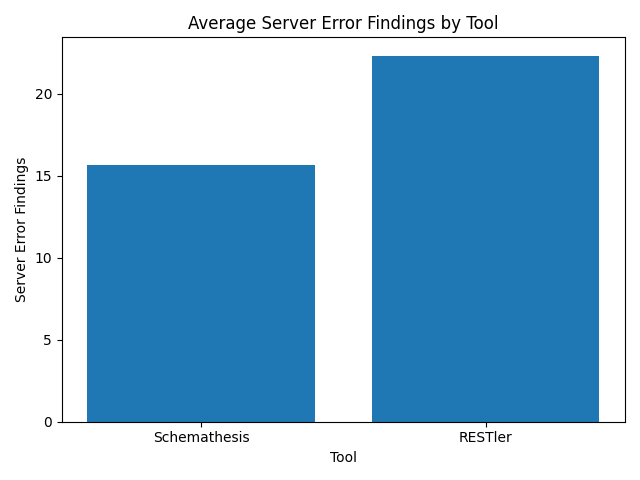

---

## 5. Interpretation

Schemathesis was easier to configure and achieved complete API coverage in this experiment. It required fewer manual adjustments and was able to execute against the target API directly after receiving the schema, base URL, and authentication token.

RESTler required additional manual intervention. Authentication had to be inserted directly into the grammar, and the binary-response endpoint had to be removed to avoid an internal decoding error. However, once correctly configured, RESTler successfully performed stateful fuzzing, created dynamic resources, and identified several reproducible bug buckets.

This suggests that Schemathesis may be more suitable for fast and broad OpenAPI-based fuzzing, while RESTler may provide complementary value when testing stateful behavior and dependencies between API resources.

---

## 6. Confirmed RESTler Findings

The following RESTler findings were manually reproduced:

| Endpoint | Result | Evidence |
|---|---:|---|
| `/workshop/api/mechanic/receive_report` | HTTP 500 | `evidence/restler/mechanic_receive_report_500.txt` |
| `/community/api/v2/coupon/validate-coupon` | HTTP 500 | `evidence/restler/community_coupon_validate_500.txt` |
| `/identity/api/v2/user/verify-email-token` | HTTP 500 | `evidence/restler/verify_email_token_500.txt` |

Other RESTler buckets remain candidates and should be validated manually before being reported as confirmed findings.

---

## 7. Key Takeaways

- Schemathesis achieved full API coverage with less configuration effort.
- RESTler required manual grammar adjustments to properly authenticate requests.
- RESTler's execution had to exclude one binary-response endpoint due to a tool-level decoding issue.
- RESTler created dynamic objects and exposed stateful behavior that is useful for dependency-based testing.
- The tools appear complementary: Schemathesis was stronger for broad coverage, while RESTler provided deeper stateful exploration after configuration.

---

## 8. Limitations

This comparison depends on the quality of the OpenAPI specification and the compatibility of each tool with the target API. RESTler's lower coverage should be interpreted together with the required manual adjustments and the binary-response limitation observed during execution.

Additionally, not all RESTler bug buckets were manually validated. Therefore, the number of confirmed findings is lower than the number of reproduced bug buckets reported by the tool.